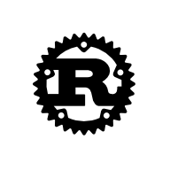

### The rust-blog-template
This blog is developed from [blog.rust-lang.org](https://blog.rust-lang.org/)
and open-sourced as [rust-blog-template](https://github.com/ShuochengWang/rust-blog-template).

Using this blog template you can create a static blog website with [blog.rust-lang.org](https://blog.rust-lang.org/) style. Not cool enough? but very Rust! Right?

### Building

To build the site locally:

```console
> git clone https://github.com/ShuochengWang/rust-blog-template.git
> cd rust-blog-template
> cargo run
```

You could do it in release mode if you'd like, but it's pretty fast in debug.

From there, the generated HTML will be in a `site` directory.
Open `site/index.html` in your web browser to view the site.

```console
> firefox site/index.html
```

You can also run a server, if you need to preview your changes on a different machine:

```console
> cargo run -p serve
Serving on: http://192.168.123.45:8000
```

### Configure Blog
You can noticed that there is a `blog.yml` in the `./posts` directory, 
just modify it according your case, and the content is like this:

```yaml
# blog title
title: Shuocheng's Blog
# The title of the index page
index-title: Shuocheng Wang's Blog With Rust-Blog Style
# blog description
description: Just a blog to record something.
# The raw-html showed in the top of the index page
index-html: This is the <b>Shuocheng Wang's Blog</b>.
            And you can call me <b>Stuart</b>.
            This blog is developed from 
            <a href="https://blog.rust-lang.org/">Rust Blog</a>
            because I'm a fan of Rust!
# blog author
maintained-by: Shuocheng Wang
# GitHub address of this blog repo or yours
github: https://github.com/ShuochengWang/rust-blog-template
# blog domain
domain: https://shuochengwang.github.io
```


- **Configure social links**:
  go to `./templates/footer.hbs` and modify the corresponding `<a></a>` link.
- **Configure Twitter card**:
  go to `./templates/header.hbs` and modify the Twitter card part.
- **Configure Facebook OpenGraph**:
  go to `./templates/header.hbs` and modify the Facebook OpenGraph part.
- **Configure the github action**:
  Modify the `./.github/workflows/main.yml` and modify the `./CNAME`.

### Write Posts

You can write your posts in `./posts` directory, and name your post as `year-month-day-title.md`, for example:
`2023-12-16-Getting-started.md` or `2023-03-09-First-post.md`.

For each post, you should add a yaml header. The standard of the yaml header is as following:

- Post with single tag:
  ```yaml
  ---
  layout: post
  title: "Getting started"
  tags: 
    - blog
  description: "Getting started"
  ---
  ```

- Post with multiple tags:
  ```yaml
  ---
  layout: post
  title: "Getting started"
  tags: 
    - blog
    - test-tag1
    - test-tag2
    - test-tag3
  description: "Getting started"
  ---
  ```

- Post without tag:
  ```yaml
  ---
  layout: post
  title: "Getting started"
  description: "Getting started"
  ---
  ```

After configure the yaml header, you can write your post content directly with markdown syntax!

##### Insert image in the post

If you want to insert image in your post, you can add the image into `./static/images` directory and create a directory with the same name of your post file, and put your image there.

For example, I want to insert an image in my `2023-12-16-Getting-started.md` post,
just create a directory named `2023-12-16-Getting-started` and put the image into this new directory.
Then I can use markdown syntax to insert this image into my post:

```md

```



### Configure "About Me" Page
There is a "About Me" page in the navigation bar of this blog.
And you can configure this page by modifying the `./posts/aboutme.md` (create one if not exist).
The format of `aboutme.md` is like following:
```
---
layout: aboutme
title: "About Me"
description: "About Me"
---
## About Me
About me
```
You can modify the title and fill your own introduction in the content.
